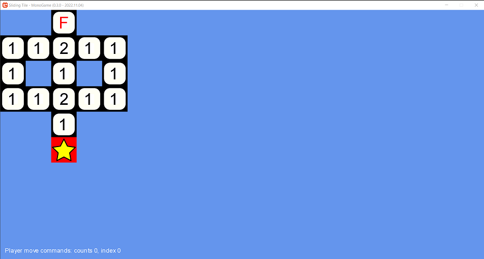
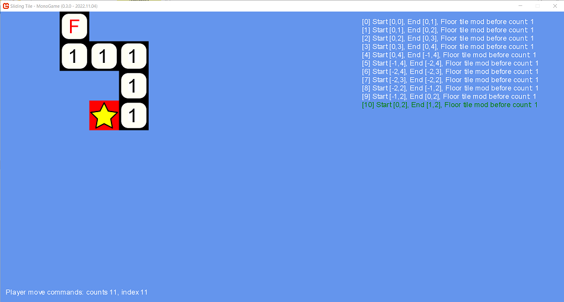
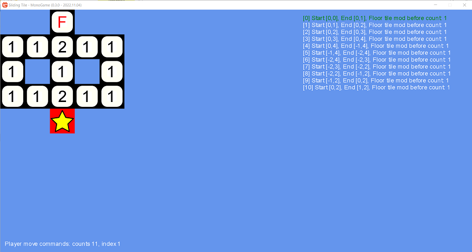
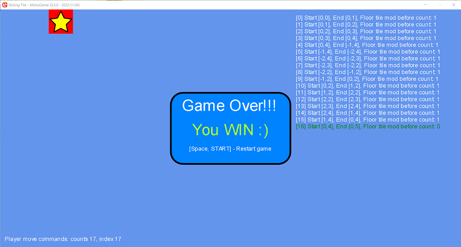

# Sliding Tile - MonoGame
 
Logic game where you should clear all tiles before reaching the finish of level. This game is developed in MonoGame.

## Builds
If you want you can download current and previous versions of builds here: https://drive.google.com/drive/folders/1nyCEaqxJy2NloJKFAAwNZ96j-HRMUazD?usp=share_link

## Screenshots
All screenshots from current and previous versions are available here: https://drive.google.com/drive/folders/1ET0xdlhZz6pxvZcgfLHfq0oO09cjEC9O?usp=share_link

### 1. At start

### 2. In random place

### 3. Undo move commands

### 4. Win Game

